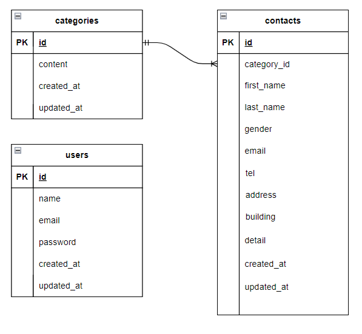

# お問い合わせフォーム

## 環境構築
<dl>
    <dt>Dockerビルド</dt>
    <dd>1. git clone git@github.com:ao-kazuyuki/confirmation_test.git</dd>
    <dd>2. cd confirmation_test</dd>
    <dd>3. docker-compose up -d --build</dd>
</dl>

<dl>
    <dt>* MySQLは、OSによって起動しない場合があるのでそれぞれのPCに合わせてdocker-compose.ymlファイルを編集してください。</dt>
</dl>

<dl>
    <dt>Laravel環境構築</dt>
    <dd>1. docker-compose exec php bash</dd>
    <dd>2. composer install</dd>
    <dd>3. exit
    <dd>4. cd src</dd>
    <dd>5. cp .env.example .env</dd>
    <dd>6. .envファイル内の下記の項目を以下のように修正</dd>
    <dd>   DB_HOST=mysql</dd>
    <dd>   DB_DATABASE=laravel_db</dd>
    <dd>   DB_USERNAME=laravel_user</dd>
    <dd>   DB_PASSWORD=laravel_pass</dd>
    <dd>7. php artisan key:generate</dd>
    <dd>8. php artisan migrate</dd>
    <dd>9. php artisan db:seed</dd>
</dl>

## 使用技術
* PHP 7.4.9
* Laravel 8.83.29
* MySQL 8.0.26

## ER図

## URL
* 開発環境 : http://localhost/
* phpMyAdmin : http://localhost:8080/